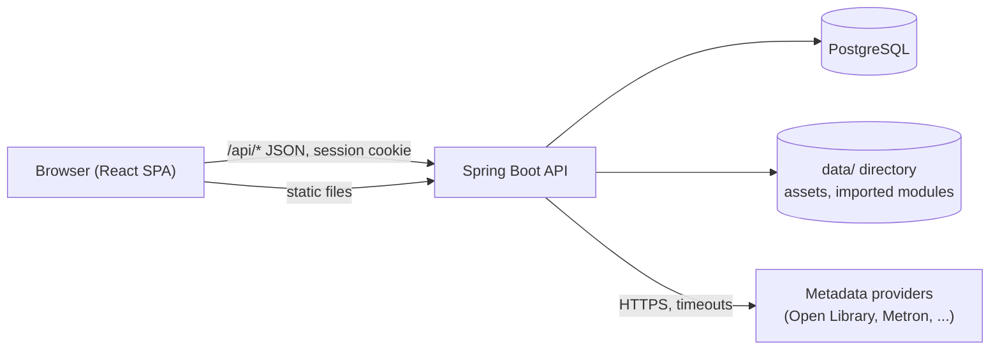
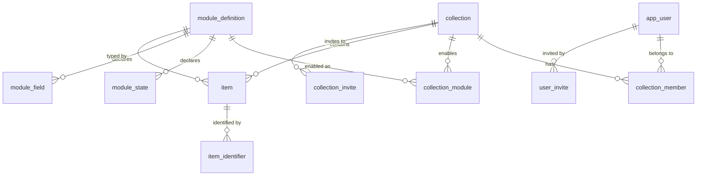

# Architecture

CurioKeep is one Spring Boot application that serves a REST API and the bundled single-page frontend, backed by PostgreSQL and a local data directory.



- **Frontend** (`frontend/`): React 19 and TypeScript, built with Vite. In production it is copied into the jar (`-Pfrontend`) and served by the backend; unknown non-API paths forward to `index.html` so client-side routes work (`SpaWebConfig`). In development Vite proxies `/api` to `localhost:8080`.
- **Backend** (`src/main/java/org/rostislav/curiokeep`): Java 25, Spring Boot 4, Spring Security, Spring Data JPA, Flyway.
- **Database**: PostgreSQL 16. Schema changes are Flyway migrations in `src/main/resources/db/migration`.
- **Data directory**: cover images (`curiokeep.assets.dir`) and imported module XML files (`curiokeep.modules.import-dir`). See [configuration](configuration.md).

## Backend layout

Packages are organised by feature. Each feature keeps its controllers in `api/`, request and response records in `api/dto/`, JPA entities in `entities/`, and its services and repositories alongside.

| Package | Responsibility |
|---|---|
| `user` | Accounts, login, the first-run admin, admin invites, admin user management |
| `collections` | Collections, members and roles, collection invites, which modules a collection has enabled |
| `items` | Items (attributes stored as JSONB), identifiers, states, item images and the asset endpoint |
| `modules` | The module pipeline: XSD validation, parsing, compiling, storing; import and scan; the module contract records |
| `providers` | The `MetadataProvider` interface, the registry, lookup and merging, one adapter per external service (`impl/`), stored credentials (`credentials/`), provider status |
| `security` | Security filter chain and the setup-mode filter |
| `health` | The `/api/health` endpoint |
| `config`, `api` | Shared infrastructure: HTTP client with timeouts, Jackson, OpenAPI, request-id logging, the common `ApiError` response and exception handler |

Controllers stay thin and call services. Services enforce access (`CollectionAccessService.requireRole`) and business rules, and map entities to response records; entities are never returned from the API.

## Data model



- `item.attributes` is a JSONB object whose keys are the module's field keys. The module definition says how to interpret it; required fields are enforced when an item is saved.
- `module_definition` stores the raw XML, its checksum and the compiled contract JSON. `module_state` and `module_field` are materialised rows for querying.
- `provider_credentials` holds provider API keys encrypted with the configured password.

## Modules and providers

A **module** describes one kind of collectible and is plain data; a **provider** is code that fetches metadata from an external service. A module's `providerMappings` connect the two: they say which key of a provider's normalized result fills which field. Details are in [modules](modules.md) and [providers](providers.md).

At startup every bundled module (`src/main/resources/modules/*.xml`) and every file in the import directory is validated and stored. If any of them is invalid the application does not start; the error lists every failing module.

## Adding an item

1. The frontend loads the collection's enabled modules and, for the chosen module, its compiled contract (`GET /api/modules/{key}`).
2. It runs one of the module's **workflows** (for example "Quick add by ISBN"): prompt for an identifier, `POST /api/providers/lookup`, let the user choose which suggested values to apply and which cover to use, then `POST /api/collections/{id}/items`.
3. The backend checks the caller's role, validates the state and the required fields against the contract, downloads the chosen cover into the assets directory and stores the item.

## Security model

- **Sessions.** Login (`POST /api/auth/login`) creates a server-side session with a `JSESSIONID` cookie (`SameSite=Lax`, replaced with a new id on every login). Everything under `/api` requires a session except the setup, invite-validation/accept and login endpoints. The bundled frontend files are public so the login page can load. Swagger UI and `/v3/api-docs` are reachable without a session.
- **CSRF.** Every state-changing `/api` request must carry the `X-XSRF-TOKEN` header with the value of the `XSRF-TOKEN` cookie, which the server sets on each response; `api/client.ts` does this for the frontend. A request without it is answered with `403`.
- **Login throttling.** After 5 failed logins for one email from one address, or 20 from one address, further attempts get `429` with a `Retry-After` header until the 15-minute window passes. The counters are in memory and reset on restart. Behind a reverse proxy the address comes from `X-Forwarded-For`, see [deployment](deployment.md#reverse-proxy).
- **First run.** Until an admin exists, `SetupModeFilter` answers every API call except `/api/setup/**` with `403 SETUP_REQUIRED`. `POST /api/setup/admin` creates the first admin and only works once. If `curiokeep.setup.token` is set, the request must also carry that token, so a server that is reachable before you finish setup cannot be claimed by someone else.
- **Accounts** are created through invites. An admin creates a user invite (valid 48 hours); the returned token is given to the person, who chooses a password when accepting. Nothing is emailed. New passwords must be at least 10 characters and at most 72 bytes (the limit of the bcrypt hash).
- **Request validation.** Request records carry Bean Validation constraints and every controller binds them with `@Valid`; a violation is answered with `400 VALIDATION_FAILED` naming the fields.
- **Collection roles**, highest first: `OWNER`, `ADMIN`, `EDITOR`, `VIEWER`. A role includes everything the roles below it can do.

| Action | Minimum role |
|---|---|
| View a collection, list and read items, see enabled modules | Viewer |
| Create, edit and re-state items, set or clear item images | Editor |
| Delete items; rename or edit the collection; enable or disable modules; manage members and invites | Admin |
| Delete the collection | Owner |

An admin cannot change or remove an owner. Collection invites default to 7 days.

- **Provider credentials** are stored encrypted (see [configuration](configuration.md#provider-credentials)) and are write-only through the API: the UI can set, clear and check them, never read them back.
- **Outbound requests** to metadata providers use one shared HTTP client with a 5 s connection-request timeout and a 10 s read timeout, and identify themselves with a fixed `User-Agent`.
- **Cover images.** A file is accepted only if its own bytes are PNG, JPEG, GIF, WebP or BMP, whatever content type or name the client gave; it is stored under a generated name with the extension of its real type (SVG and HTML are refused) and served with that type, `nosniff`, a `Content-Security-Policy` that forbids scripts and a private cache header. Uploads are limited to 5 MB.
- **Downloading a cover from a URL** uses a dedicated client that refuses anything but `http`/`https` on ports 80 and 443 and checks every connection, including redirect hops, when the host name is resolved: loopback, private, link-local and other non-public addresses are refused, so the feature cannot be used to reach the database or other internal services. The body is read with a 5 MB cap.
- **Errors** returned to clients use the `ApiError` shape (`error`, `message`); client mistakes get a matching `4xx` (`400 VALIDATION_FAILED` or `MALFORMED_REQUEST`, `403`, `404`, `409`, `413`), and unexpected errors return a generic message and are logged with a request id (`rid`).

## Frontend layout

```
frontend/src
  api/          client (base URL, CSRF header, error mapping, GET de-duplication), cache, shared types
  auth/         session context and route guards
  components/   app-level components (toasts, loading and error states) and components/ui (shadcn primitives)
  features/     collections, items, modules, providers, admin, forms: pages, components, hooks and API modules per feature
  layout/       app shell, top bar, side navigation
  pages/        dashboard, login, setup
  routes/       route table with lazy-loaded pages
```

Components never call `fetch` directly; they use the per-feature API modules built on `api/client.ts`. The module contract types the UI works with are in `features/modules/moduleTypes.ts` and mirror the backend's contract records.

## Testing

- **Backend**: JUnit 5 and Mockito. Controllers are tested with standalone MockMvc, services with mocked repositories, providers against `MockRestServiceServer`, and the module loader against the real XSD, compiler and JSON schema with only the database mocked. The single `@SpringBootTest` is a start-up smoke test on H2 with Flyway disabled, so **migrations and PostgreSQL-specific SQL are not covered by the automated tests**.
- **Frontend**: Vitest with Testing Library, run with `npm test`.
